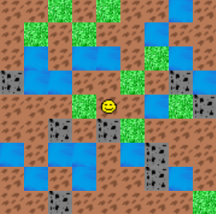
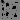

# ExplorerGame
A birds-eye-view explorer game where a player can move around a randomly-generated map.

## Execution
Double-click the JAR executable or run `mvn clean javafx:run` from the root directory.

## Controls
| Input | Movement |
|-------|----------|
| W     | Up       |
| A     | Left     |
| S     | Down     |
| D     | Right    |

## Textures
| Name      | Image                               |
|-----------|-------------------------------------|
| Coal      |     |
| Dirt      |     |
| Grass     |    |
| Player    |   |
| Water     |    |

